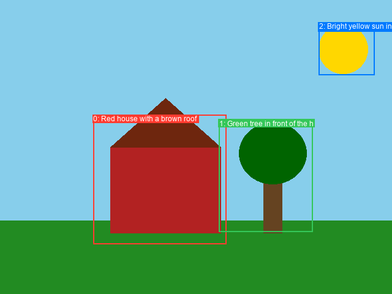

# Ideogram-4 JSON Prompt from Image (ComfyUI node)

A ComfyUI custom node that looks at an image and writes an **Ideogram-4 style JSON prompt** for it.

It uses a vision-language model (**Qwen2.5-VL**) to:
1. Describe the whole image (summary, style, lighting, medium).
2. Find the main objects/text and their bounding boxes.
3. Caption each region.
4. Pack everything into the strict Ideogram-4 caption schema.

You also get a **bbox overlay image** so you can see how the picture was divided and labelled.



---

## Install

1. Clone into your ComfyUI `custom_nodes` folder:
   ```bash
   cd ComfyUI/custom_nodes
   git clone https://github.com/LamShiuChing/ideogram-4-image-to-json.git
   ```
2. Install requirements into the **same Python ComfyUI uses**:
   ```bash
   pip install -r ideogram-4-image-to-json/requirements.txt
   ```
   (Portable ComfyUI: use `python_embeded\python.exe -m pip install -r ...`)
3. Restart ComfyUI.

The Qwen2.5-VL model downloads automatically the first time you run the node
(~7 GB for the 3B model) into your Hugging Face cache.

---

## Use

1. Add **Load Image** → connect to **Ideogram-4 JSON Prompt from Image**
   (right-click → Add Node → category **Ideogram4**).
2. Queue the prompt.
3. Outputs:
   - `json_prompt` — compact JSON (feed this to Ideogram-4 / save it).
   - `preview` — the same JSON, pretty-printed. Also shown inside the node.
   - `bbox_overlay` — the image with numbered boxes drawn on it.

### Inputs

| Input | What it does |
|-------|--------------|
| `image` | The image to analyze. |
| `vlm_model` | Which Qwen2.5-VL model to use (3B = lighter, 7B = better). |
| `max_elements` | Max number of regions/objects to caption. |
| `include_colors` | Add dominant `#RRGGBB` color palettes to the JSON. |
| `anonymous` | **Privacy mode.** Don't describe a person's face, eyes, hair, skin, body, tattoos, age, etc. — only generic terms (a woman, a man, she, he) plus their clothing, outfit, and jewelry. |

---

## Output shape

```json
{
  "high_level_description": "A lone sailboat on calm water at sunset.",
  "style_description": {
    "aesthetics": "serene, warm, golden hour",
    "lighting": "golden hour backlighting",
    "photo": "wide angle, f/8",
    "medium": "photograph",
    "color_palette": ["#FF6B35", "#004E89"]
  },
  "compositional_deconstruction": {
    "background": "A calm ocean stretching to a low horizon...",
    "elements": [
      {
        "type": "obj",
        "bbox": [100, 300, 700, 900],
        "desc": "A single sailboat with a white triangular sail.",
        "color_palette": ["#FFFFFF", "#FF6B35"]
      }
    ]
  }
}
```

`bbox` is `[y_min, x_min, y_max, x_max]`, normalized to **0–1000**, top-left origin.

---

## Notes

- Needs a recent `transformers` (≥ 4.49) with Qwen2.5-VL support — already present in most current ComfyUI builds.
- First run loads the model into VRAM (~6 GB for 3B). A GPU is strongly recommended.
- Tests: `python tests/smoke_test.py` (fast, no download), `python tests/run_qwen.py` (real model).
